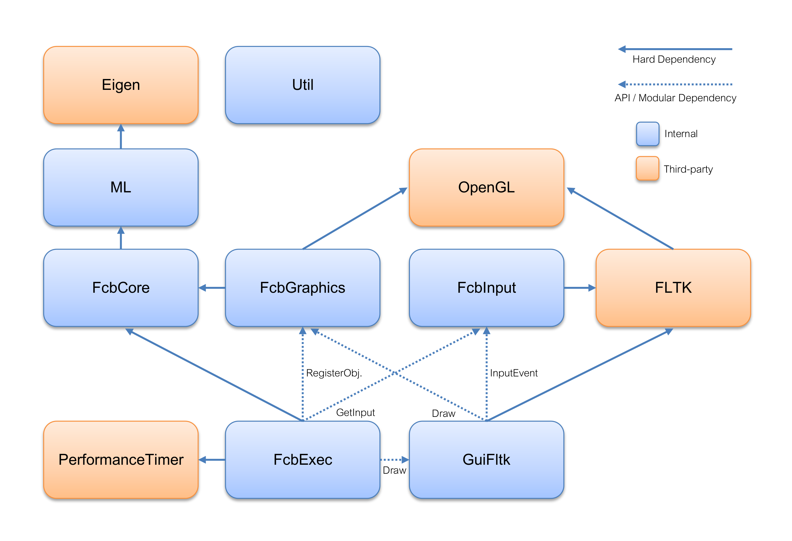

# Fox  Clover Bunny

Fox Clover Bunny is a project for experimenting with machine learning.

Bunnies eat clovers, and foxes eat bunnies. Each Bunny and Fox has a neural network that controls its movement. The training is done by genetic algorithm. The most successful animals have a higher chance of passing on their neural network weights to the next generation.

Fox Clover Bunny is cross-platform and is written in C++17. It uses FLTK and OpenGL for display and Eigen for matrix operations.

# Neural Network Design

This information pertains to this release. The hyperparameters are subject to change in the future as the project evolves. In particular, I hope to make them all configurable by file.

The neural net setup (number of nodes, choice of input, use of output) for this initial release is based on Mat Buckland's recommendations in his "Smart Sweepers" tutorial (http://www.ai-junkie.com/ann/evolved/nnt1.html). The genetic algorithm is different. The results of this release match Buckland's results.

There are currently no foxes--only bunnies and clovers. The neural network is a traditional 3-layer neural network. There are 4 inputs. 2 are a normalized vector to the nearest clover and the other 2 are a normalized vector indicating the direction the bunny is pointing. The hidden layer has 6 nodes. The output layer has 2 nodes.

The two outputs are interpreted left push and right push. Similar to the treads of a tank, which can be moved independently, the left and right push allow the bunny to move forward at various speeds. It can also turn if there is a difference between the two forces.

The weights are represented as matrixes. Instead of keeping a separate vector of biases, the weights have an additional column. This means that an extra input node is required that is always set to 1. The `NeuralNet::InputType` takes care of these details so the user doesn't have to think about it.

You need to set the values of the inputs before calling `NeuralNet::FeedForward`. You can then use the output values for whatever purpose. The matrixes and operations are provided by Eigen. Use the `()` operator to access elements. The data type is `float`. Eigen uses column-major order (the opposite of C++). `InputType` and `OutputType` are row-vectors.

The number of nodes can be changed by setting `NeuralNet::NUM_INPUTS`, `NeuralNet::NUM_OUTPUTS`, and `Globals::c_numHiddenNodes`. The number of layers is fixed to 3, but hopefully will be configurable soon in a coming update. Go ahead and try adding different kinds of inputs to see what happens.

The weights are initialized randomly with a uniform distribution in the range *[-0.8, 0.8]* inclusive.

# Genetic Algorithm Design

The neural network training is unsupervised and uses a genetic algorithm. The genes are the neural network weights, which are initialized randomly.

Each generation has a population of 50 bunnies. A generation is a 15-second round. The time can be changed by setting `Globals::c_secondsPerGeneration`. Bunnies are scored on how many clover bites they take in the round. By default, the clovers only have 1 bite, but this can be changed by setting `Globals::c_cloverHp`. At the end of the generation, the bunnies are ranked by clover bites and the top scorers have a higher chance of being selected for reproduction. Selection is done via roulette in the function `BreedPopChance50`. Each of the 50 ranks has a hard-coded selection chance. In the near future I want to create a function that will work with any size of population.

Parents are paired up and their weights are mixed together to form a set of weights for their child. The function that combines the weights is called crossover because it defines a random number of crossover points. Between crossover points, the weight values are taken from the same parent. The copied-from parent switches at each crossover point. The function 0.7^x describes the chance of the number of crossover points being selected. There is a 0.7 chance to add a crossover point, and it continues to roll again until a crossover point is not added. The number of points keeps increasing until a crossover point is not added.

After crossover, there is a 0.15 mutation chance. To mutate, a random weights column is chosen and each element adds or subtracts a random value from 0 to 0.5. Recall that a column represents the weights to the inputs for its output node. For example, if the node is in the hidden layer, the perturbed weights are all of the inputs leading into that node. After a mutation occurs, the chance is rolled again.

The entire population is replaced with children. (However, there is a chance that some of the children have all the weights of one parent if no crossover points or mutations occur, or if a parent is bred with itself.)

# Project Structure

### Directory Structure

* bin/

  *Fox Clover Bunny pre-built binaries for Windows and Linux.*

* src/

  *Source code for the project.*

  * fcb/

    *The main library for Fox Clover Bunny specific code.*

    * core/

      **FcbCore**

      *Game objects--foxes, clovers, and bunnies. Also contains FCB globals.*

      `Globals`, `GameObject` (base class), `Fox`, `Clover`, `Bunny`

    * exec/

      **FcbExec**

      *The main game loop and executable.*

    * graphics/

      **FcbGraphics**

      *The default drawing code for the game world.*

      Classes: `World`, `GraphicsObjectManager`

      `ModelBunny`, `ModelClover`, `ModelFox`

      API: `Draw`, `Refresh`, `RegisterObject`

    * input/

      **FcbInput**

      *Translates user input from the GUI into controller input state usable by FCB*

      Classes: `InputState`

      API: `ProcessFltkInputEvent`, `GetInputState`

    * gui/

      **GuiFltk**

      *The default library for the user interface. Handles display and input.*

      Classes: `GuiContext`, `MainWindow`

      API: `Init`, `Deinit`, `Draw`, `HandleEvents`

  * ml/

    **ML**

    *Machine Learning code.*

    `NeuralNet`, `BreedPopChance50`

  * util/

    **Util**

    *Helpful functions.*

    `rng`

* third-party/

  *External libraries.*

### Library Dependencies

### Modularity

Fox Clover Bunny is designed so you can switch out the graphical components easily. If you want to make some improved OpenGL graphics, all you have to do is replace *FcbGraphics* with your own. If you want to switch out FLTK for a different GUI, you only need to change *GuiFltk* and *FcbInput*. If you want to make a different game but re-use the drawing code, just change the _Fcb*_ components.

You can also rework *FcbExec* so it's driven by *GuiFltk* via update calls, as is common with game engines.

# Setup, Build, and Run

### Step 1/3: FLTK

Fox Clover Bunny is based in part on the work of the FLTK project (http://www.fltk.org).

* https://github.com/fltk/fltk

FLTK is a dependency to build the *Gui*, *FcbGraphics*, and *FcbInput* targets. Fox Clover Bunny is designed so you can use a different GUI, add your own graphics, or re-use the GUI with a different game. You can actually run the *FcbExec* target without FLTK, but you won't be able to see much without creating your own graphics.

The version of FLTK used is 1.3.5.

##### Visual Studio

**I pre-built and included the FTLK 1.3.5 release as static libraries. CMake should automatically use them.** I built 64-bit, debug and release configurations with Visual Studio Community 2019 Version 16.6.2, MSVC 19.26. If you're using **Visual Studio 2019**, these will hopefully work and you can **continue to the next step**. If you're using **Visual Studio 2017**, they will probably not work and you will have to **build FLTK yourself**.

If the pre-built binaries don't work, you can easily build FLTK yourself.

1. Open your start menu. Start typing "Developer Command Prompt for VS" and open it.
2. `cd` to the directory you want the FLTK repo.
3. `git clone https://github.com/fltk/fltk.git`
4. `cd fltk`
5. `git checkout release-1.3.5`
6. `mkdir build`
7. `cd build`
8. Decide if you want to install to Program Files or not. It can easily be "uninstalled" from Program Files by deleting the FLTK folder, so I recommend the default location. However, if you don't want to pollute your Program Files with things that don't have an automatic uninstaller, you can install to a custom location, such as the FLTK build directory.
9. `cmake ..` and if you don't want to install to Program Files, add `-DCMAKE_INSTALL_PREFIX=install`
    Tip: Watch out for a message that says "The following three headers should all be found!"
10. Open the generated solution.
11. Set the configuration to Debug. Build everything. If there are any errors, build again.
12. Find the INSTALL target and build it.
     Tip: If you install to the default location (Program Files), you need to run Visual Studio as an administrator.
13. Now do the same thing for release: Set the configuration to Release. Build everything. Then find the INSTALL target and build it.
14. If you chose a custom install location, you will have to give that location to CMake with
      `-DCMAKE_PREFIX_PATH=______` when building Fox Clover Bunny in the next step.

##### Ubuntu

OpenGL: `libgl1-mesa-dev`

FLTK: `libfltk1.3-dev`

Together: `sudo apt install libgl1-mesa-dev libfltk1.3-dev`

Now scoff at the Windows users who had to build FLTK.

### Step 2/3: CMake

1. `git clone --recursive https://github.com/akfreed/FoxCloverBunny.git`
   Tip: If you forget the `--recursive` you can do a `git submodule update --init --recursive` any time.
2. `cd FoxCloverBunny`
3. `mkdir build`
4. `cd build`
5. `cmake ..` On Linux, add `-DCMAKE_BUILD_TYPE=Release`. On Windows, if you both built your own FLTK **and** installed to a custom location, also add `-DCMAKE_PREFIX_PATH=_____` here.

##### Tips for Visual Studio

Tip: If you're using VS 2017, which configures for 32-bit by default, the pre-built binaries won't work, as I built them for 64-bit. Add this to your `cmake .. ` command: `-G Visual Studio 15 2017 Win64` . Of course, if you built the binaries yourself, it doesn't matter, as long as you build Fox Clover Bunny the same. 64-bit is recommended, but not necessary at this time, as the process doesn't use a lot of memory.

##### Tips for Linux

While a Visual Studio solution allows the user to switch between Debug and Release configurations, on Linux it's best to create two builds, e.g. a folder called `debug` and a folder called `release` that are built with `cmake .. -DCMAKE_BUILD_TYPE=Debug` and `-DCMAKE_BUILD_TYPE=Release` respectively.

##### Why build Release?

Eigen runs faster in Release. Everything else does too, since optimizations are enabled, but mostly it's for Eigen, which runs prohibitively slow in Debug configuration.

Eigen is the math library used for matrix multiplications. It runs really slowly when built for debug. I believe there is an option to forgo the runtime debug checks, but honestly it's a good idea to keep them in there. Any time you change something that uses Eigen, e.g. adding inputs, you should test it in debug mode. Otherwise, it's really easy to get unchecked array bounds overflows.

Besides `Debug` and `Release`, there's also a `RelWithDebInfo` option that is mostly intended for profiling, but can be useful if you want to run at full speed while retaining some (albeit minimal) debug capabilities. Note that the code flow will jump around unexpectedly if you debug in this configuration due to optimizations.

### Step 3/3: Build and Run

If there are any issues with the libraries, they will likely appear as linker errors during the build step. If you make a fix, it's best to delete the `build` folder and retry everything with a fresh CMake run.

##### Visual Studio

`F5`

##### Linux

`make -j`

`src/fcb/exec/FcbExec`

# Keyboard Commands

Press spacebar to execute as fast as possible without displaying anything.

# Experimenting

There are some settings you can change in the `Globals` class. The number of inputs and outputs can be changed from the `NeuralNet` class. You can change a bunny's behavior by modifying the `Bunny` class' `Think` and `Act` functions.

# Release Notes

Fox Clover Bunny release-0.7

* First release!
* Foxes have not been put in the game yet, but everything is there if you want to add them yourself.
* Fast-forward with spacebar
* You can add your own GUI and/or graphics.

# Future Work

* Add Foxes.
* Add a general population roulette selection function.
* Build FLTK DLLs instead of static libraries, so there is less pain in the setup.
* Make the number of hidden layers configurable.
* Read hyperparameters from a config file or command line arguments.
* Save / load weights.
* Statistics and analysis of GA.

###### No bunnies were harmed in the making of this project.
